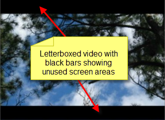
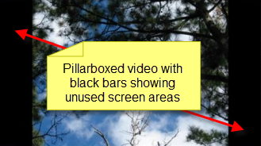

# Glossary

## ACN
Architecture for Control Networks (ACN) is a suite of network protocols for theatrical control. [Click here](http://wiki.wireshark.org/ACN) for more details.

## ArtNet
ArtNet is a protocol for sending DMX data over IP networks. [Click here](https://en.wikipedia.org/wiki/Art-Net) for more details.

## CCLI
Christian Copyright Licensing International (CCLI) was established in 1988 to provide churches with simple, affordable solutions to complex copyright issues. CCLI helps churches maintain their integrity and avoid costly lawsuits, while also giving churches the freedom to worship expressively and spontaneously. [Click here](https://uk.ccli.com) for more details.

## CITP
Controller Interface Transfer Protocol - A network protocol which allows communication between media servers and lighting consoles. Any supporting lighting console will be able to detect and patch Screen Monkey as well as display thumbnail images of media within Screen Monkey. This is helpful when controlling Screen Monkey via ArtNet. [Click here](http://www.citp-protocol.org/index.php) for more details.

## CODEC
COmpressor/DECompressor - When content such as Audio or Video is created, it is often Compressed in order to produce smaller files. When it is played back, it must then be Decompressed. What is used is known as a CODEC. There are many CODECs in use today for assorted media types.

## DMX
Digital MultipleX - DMX is a standard protocol by means of which theatre lighting control desks can communicate with lighting equipment. It was designed to allow equipment from different companies to be used together easily. [Click here](https://en.wikipedia.org/wiki/DMX512) for more details.

## DVD
Digital Versatile Disc - This is a common format for storing and distributing motion picture content. Because of the use of Video, many folks mistakenly believe it means Digital Video Disc.

## Letterboxing
When many video types are recorded, they are recorded at a size that isn’t really compatible with televisions. For many years, televisions offered a 4x3 aspect ratio. This meant four units across by three units up and down. So if the units were measured in feet, a very large television would measure four feet across by three feet high. Often, video content is recorded in a 16x9 format. Because of this, when content intended for 16x9 is played on a device expecting 4x3, it is often “letterboxed” so that the full 16x9 fits on the 4x3 screen. When letterboxing occurs, you normally see black bars appearing on the screen above and below the video content.

## Lower Third
When you see television news reports and an interview occurs, you often see what is called a “Lower Third” that presents the title and name of the person being interviewed. These are typically placed on top of the video image in the bottom 1/3 of the screen area. [Click here](http://en.wikipedia.org/wiki/Lower_third) for more information on Lower Thirds.

## MIDI
Musical Instrument Digital Interface - This is an industry-standard protocol that enables electronic musical instruments (synthesizers, drum machines), computers and other electronic equipment (MIDI controllers, sound cards, samplers) to communicate and synchronize with each other. [Click here](http://en.wikipedia.org/wiki/Midi) for more information.

## MSEX
Media SErver eXtensions - The Media Server Extensions layer is the part of the suite of protocols that is used for communication between a controller and a media server. It allows information for specified elements to be passed from the media server to the console and/or visualizer. 

## Pillarboxing
Sometimes video content is recorded in a 4x3 format and played back on a 16x9 device. Because of this, when content intended for 4x3 is played on a device expecting 16x9, it is often “pillarboxed” so that the full 4x3 fits on the 16x9 screen. When pillarboxiing occurs, you normally see black bars appearing on the screen to the left and right of the video content.

## Pixel
The term Pixel is a contraction between the words PIcture and ELement. Pixels are the smallest unit of measurement for a computer screen. All the different Pixels combined make up the mosaic of the image presented on the screen.

## RDM
Remote Device Management or RDM is a protocol enhancement to USITT [DMX512](http://en.wikipedia.org/wiki/DMX512 “DMX512”) that allows bi-directional communication between a lighting or system controller and attached RDM compliant devices over a standard DMX line. This protocol will allow configuration, status monitoring, and management of these devices in such a way that does not disturb the normal operation of standard DMX512 devices that do not recognize the RDM protocol. The standard was originally developed by the Entertainment Services and Technology Association - Technical Standards (ESTA) and is officially known as “ANSI E1.20, Remote Device Management Over DMX512 Networks. [Click here](http://en.wikipedia.org/wiki/RDM_(lighting)) for more details.

## Relative Pathing
When creating links or references to files or web pages, there are two ways to reference the file or page.

1.  One is called Absolute
2.  The other is called Relative

If an Absolute link or reference is created, it means that the file or page linked to is expected to be found in a specific location, such as perhaps `C:\SomeFolder\SomeOtherFolder\SomeFile.EXT`

If a Relative link or reference is created, it means that the file or page linked to is expected to be found in a location that is *Relative* to the current location. For example, one folder above where you are, the same folder you are in or a folder below where you are.

Screen Monkey uses Relative Paths for links to its Media files.

## VOB
Video OBject - This is a file type stored on DVD media. The VOB typically contains the motion picture as well as the audio content.

## URL
Uniform Resource Locator - A URL often contains a domain name. For example, `http://www.google.com` is a URL.