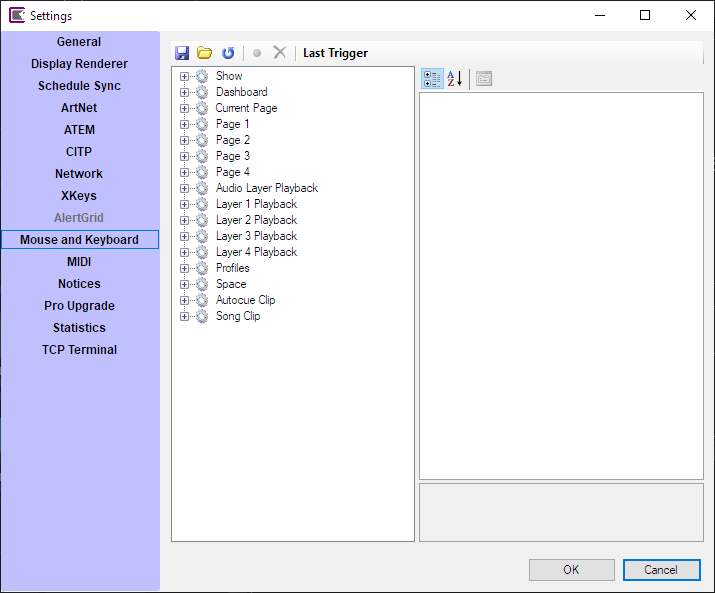
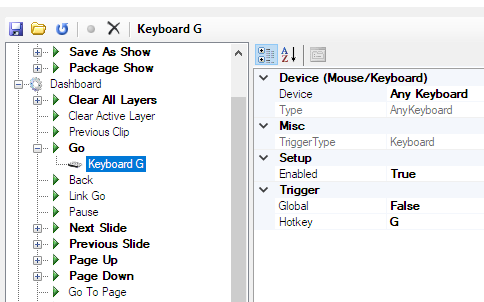

# Mouse and Keyboard

The Mouse and Keyboard settings section enables you to configure any mouse action or keyboard keystroke to control Screen Monkey.

A comprehensive tree structure shows all the actions in Screen Monkey which can be assigned to mouse and keyboard. The tree is divided into sections which need to be expanded to see the actions.

## Assign a new key
To assign a new keystroke or key combimation to an action follow these steps.

1. Find the action to assign this key to in the tree
2. Press the key or key combination you wish to assign, it will be described in the toolbar, replacing the text 'Last Trigger'
3. Double-click the action 
4. The action will now have a sub-item which shows the new assignment

The example below shows the keystroke 'Keyboard G' at the top of the dialog and the 'Go' action in bold to which it has been assigned. 

Each action may have any number of keys assigned to it. This would allow for 'next slide' to be assigned to both the up and the right arrow keys should you wish.

## Toolbar
Across the top of the dialog there is a small toolbar with the following buttons.

- **Save** Export the current keyboard and mouse settings to an XML file for backup or to transfer to another computer.

- **Open** Import keyboard and mouse settings from an XML file. This action will completely replace all local keyboard and mouse settings with the ones in the file.

- **Reload** Reset the keyboard and mouse settings to factory defaults. You will be asked to confirm this action.

- **Record** Assign the last trigger to an action. This is an alternative method to double-clicking the action to assign.

- **Clear** Select a keyboard mapping that you no longer require and press the Clear button to remove it. 

- **Last Trigger** Will display the most recent keyboard combination typed so that it can be quickly assigned.

## Assigning keys to specific clips
It is possible to assign a trigger key to any clip on the dashboard. These keys are assinged using [Trigger mode](../toolbar/trigger.md) which is enabled from the toolbar.