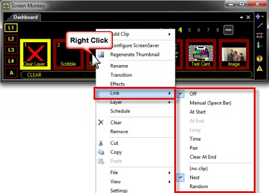

# Linking Clips

Linking clips gives you the ability to play one clip immediately after another, or after a time delay, or play when the Go key is pressed. Links may be used to create a slideshow of different clips but their capability goes far beyond that. By using links very complex shows can be highly automated. When one clip has been linked to another, the clip you linked to will be played next.

## Link Menu

To link any clip, right-click the clip to display the context menu, select Link > and choose type of link you desire to create.

Note that linking is really a two part process consisting of When and What.

First you choose When the link will occur. At Start, At End, At a specific Time.

Then you choose What clip you are linking to.

When you link clips together you have several link types to choose from:

## Link Editor

## Link Types

|Link Type|Description|
|-|-|
|Off|No link is set.|
|Manual|This clip will link to the next clip when the GO key is pressed. By default the GO key is the spacebar. This may be reassigned in the [Screen Monkey settings](../../Reference/Setup/Settings/Settings.md).|
|At Start|The linked clip will begin playing at the same time as the current clip. This link type is only valid for links to clips that play on other layers.|
|At End|The linked clip will begin playing when the current clip finishes. This type is only applicable to clips which end such as audio, video or DVD. On a clip such as an image this option will be disabled as an image clip has no end.|
|Loop|The current clip will begin playing again when it finishes. This is the equivalent of linking the clip to itself. This type is only applicable to clips which end such as video. On a clip such as an image, this option will be disabled as an image clip has no end.|
|Time|The linked clip will begin playing after a specified time. When you select this option you will be presented with a dialog to enter the time.|
|Pair|When you pair two clips together playing the one with the link also plays the other (typically on another layer). You may want to pair an audio clip with a video clip so the audio plays whenever the video plays. You may also have a space clip with a play list of audio clips which you want to pair to a PowerPoint clip.|
|Clear At End|When the clip finishes playing, the layer is cleared. For example, perhaps you have an Audio clip. You click and the audio begins playing. As it completes the Audio layer is cleared and the clip returns to a normal state.
|{no clip}|Once a clip has been linked the Clip name or label will appear here. Until you choose to create a link you see {no clip}.|
|Next|When you choose Next, Screen Monkey links to the next clip in the list. The list will always play in clip order.|
|Random|When you choose a Random link, Screen Monkey will select a random clip to link to. The random option can be useful it you want to shuffle the clip playback within a [space](../../reference/clipTypes/CueListSpaceClip.md).|

When you are creating a link, the default behavior is for Screen Monkey to try and link to the next available clip. If no clip exists in the next slot, Screen Monkey presents a window allowing you to select the clip you want to link to.

There are two clips shown in the image above that require explanation. These are the Clear Layer clips named “Clear Layer 3” etc. You may link to these clips to clear the indicated layer. This is very handy if you want something to appear, then disappear when it has finished.

When a clip has a link assigned it is indicated by a link icon in the clip panel border.

Creating links on several clips individually can be very tedious. Luckily you can change the link in the multi-edit mode. [Click here](SelectingMultipleClips.md) for instructions on how to enter multi edit mode. The link operation will mostly work the same in this mode but a few things behave differently.

In multi edit mode it may be possible to create a link list in a specific order. Select the clips in the order you want them to play and enable the link.

Once you have linked a clip it will not use the multi edit selection order to assign the link. So you need a way to force the clips to be linked in the selection order. You will notice when in multi edit mode the link menu has a different option.

If you select Play In Selection Order the links for the selected clips will be created in the order you selected them.

## Using Multiple Clip Links

You can link a clip to multiple items rather than just a single clip. The default as before is to link to just a single clip but if you select either “More Options” or the “Link” option from the clip menu it will allow you to specify additional links.

Using the links editor you can add additional links to a clip or edit existing links. When you add or edit a link the following editor will open.

The link editor allows you to change the type of link, the target clip and any additional settings for each link.