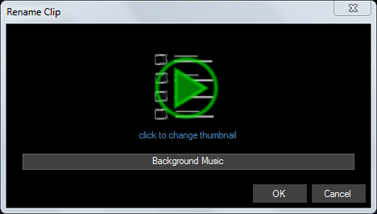
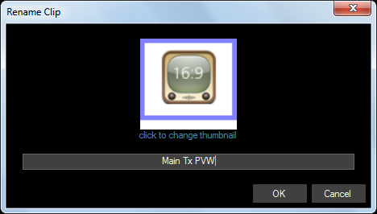

# Renaming Clips
Every clip has a name to identify it from other clips. This name is displayed underneath the the clip in the dashboard. This can be [disabled in settings](../Settings/General.md) if you prefer. Clip names are also used when creating links and schedules.

When you create a clip the name is set automatically using either the filename or an appropriate description. It is often helpful to change this name.

## Changing the Clip Name
To change the clip name place the mouse over the clip you wish to rename and click the right mouse button to bring up the popup menu. From the menu select ‘Rename’. This will bring up a dialog in which you can type in a new clip name. Click OK to change the name.

## Changing the Clip Thumbnail
The thumbnail is either generated from the media (for video, image and text based clips) or the clip type icon is used. As well as changing the name it is also possible to change the thumbnail to be any icon you create. Simply rename the clip and click ‘Change thumbnail’ then select an image file on your computer to use as the icon. All common image formats are supported. The ideal size for this thumbnail image is 84x84 pixels however any size can be used.

*Tip:* If you create your thumbnails with a coloured border as shown above you can quickly identify different clip actions. For example, if you are controlling a [video router with macros](../macros/videohub.md) use a blue border for routing to a preview monitor and red border for routing to the main transmission output. 

## Notes
- It is possible to have more than one clip with the same name. Internally Screen Monkey will treat them as separate clips. This is useful if you wish to see the ‘same’ clip on more than one page.