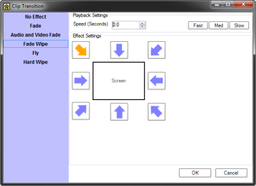
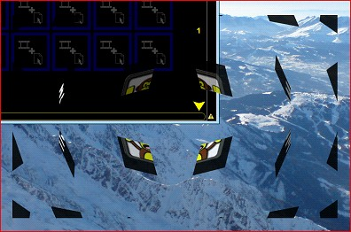
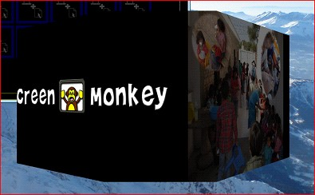

# Transitions
Transitions allow you to choose how clips appear on the output. If no transition is specified then clips appear immediately full screen (known as a cut in video production terminology).

By using the transition settings you can choose many other options which can make your show more professional and engaging. By configuring a fade transition a clip might gently fade into view as opposed to immediately appearing.

## Selecting a Transition Effect
There are many transition effects to choose from and different parameters which specify how the effect behaves. The default transition is ‘No Effect’ which means the clip will immediately appear on the screen.

To change the transition of a clip right-click the clip in the Screen Monkey dashboard to display the popup menu and select ‘Transition’. This will present the transition settings dialog as shown below.

|Name|Description|
|-|-|
|No Effect|The default for new clips, equivalent to a cut|
|Fade|The clip will gradually appear over the time specified, equivalent to changing transparency from 100 to 0|
|Audio and Video Fade|Very similar to the ‘Fade’ transition except audio is also faded in the case of video and audio clips|
|Fade Wipe|A combination of fade and hard wipe, the new clip will gradually fade in and move over the previous clip starting in the position specified|
|Fly|The new clip moves over the top of the previous clip starting in the position specified|
|Hard Wipe|The new clip will wipe across the previous clip starting in the position specified|

If you want a cross dissolve effect where one clip fades out and a second clip simultaneously fades in then apply the ‘Fade’ transition to *both* clips.

## Playback Settings 
First choose an effect from the list on the left and then enter a transition time which is the time taken for the transition to complete. To change the time take one of the following actions.

- Type a new speed value into the field
- Click the Up or Down arrow buttons
- Click the Fast, Med or Slow buttons

Depending on the transition you select there may be other configuration options. For example, Fade Wipe, Fly and Hard Wipe allow you to select a direction for the transition effect.

Not all clips support transitions. If the clip type does not support transitions it will simply appear as if the effect was set to none.

<!--
***

## WPF Effects

When using the [WPF renderer](..\..\reference\setup\settings\DisplayRenderer.md) you may be able to use the new 3D transition effects. These effects will only be available to you if the WPF renderer is selected in the Screen Monkey [settings](../../Reference/Setup/Settings/Settings.md).

Explosion

Rotate

-->