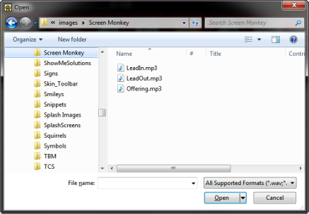
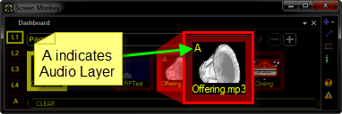

# Audio Clip

The Audio Clip allows you to play an Audio file to the default audio ouptut of the computer. The audio output used is configured in Windows audio device settings.

*Note:* Screen Monkey has no capability to play an audio CD inserted in the computer. You will need first to rip it to a compatible file format so it exists as a file on your computer.

## Add an Audio Clip
Click or Right-click a slot and choose Audio.

You are presented with a file browsing dialog from which you may browse the PC file system and select the Audio clip you wish to use.

You may also click and drag audio clips from Windows Explorer to Screen Monkey to add audio.

The supported audio formats are:

*   \*.AAC
*   \*.M4A
*   \*.MP2
*   \*.MP3
*   \*.WAV
*   \*.WMA

When an audio clip has been added, it is automatically assigned to the Audio Layer and the clip has an A indicating this.

## Configure an Audio Clip

### Mute

### Cue/Edit

### Transition
assigning a [Transition](../clipSettings/transition.md) 

## Use an Audio Clip during a show
When presenting a show, you left click the clip icon on the Screen Monkey dashboard to begin playing it. Clicking the clip again will pause playback.

You may wish to use the [Live Monitor](../toolbar/preview.md) in order to see other playback controls as well as keep an eye on elapsed time and time remaining.

