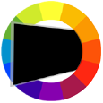
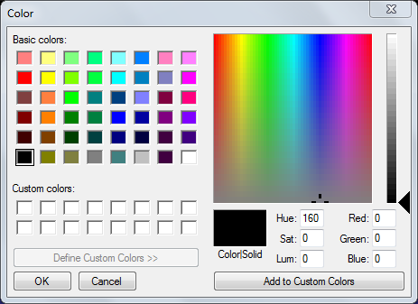

# Colour Clip

The Colour Clip allows you to generate a full screen solid matt of any colour. When a Colour clip is added you are presented with a colour palette from which you may select the color you wish to use.

If the colour you want is not in the palette, click ‘Define Custom Colours’ and a full color spectrum will be shown. Once you have selected the colour, click ‘OK’. The slot thumbnail will change to the reflect the color you selected.

*The Colour Clip has no edit function. If you wish to change the colour generated by the clip you must Clear or Remove the clip and re-add it with the desired color.*

## Use cases
- You may wish to use Colour Clips to temporarily hide the screen as you perform other activities. Put the colour clip on a higher layer than the clips you are manipulating. For example black on Layer 4 and Song Words on Layer 1. With the black clip live you are free to look at different sections of the song clip on Layer 1 without the output changing.

- Or perhaps there is a point in a church service where what is being projected is simply too bright. In this case you might use the black colour and fade it a bit to dim the projector output to a more suitable level.

- Perhaps you are playing a Video Clip on Layer 1 and you have assigned the Colour Clip to Layer 2. You click the Colour clip and floods the screen area of Layer 2 with whatever colour was configured. Layer 1 will continue playing but will not be seen as the Colour Clip is now playing on Layer 2 and is covering Layer 1.
 
- Colour Clips are a great way to gently fade other things into or out of view. You use them as a mask and combine them with the Layers Dashboard to manipulate the fading.

- A solid colour is a quick and easy clip to create and can be used to simply test your output is working as expected on the external display device.