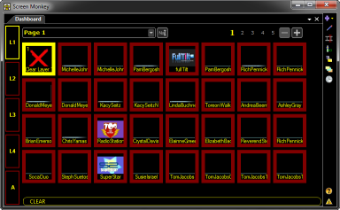
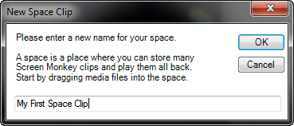
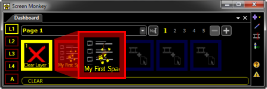
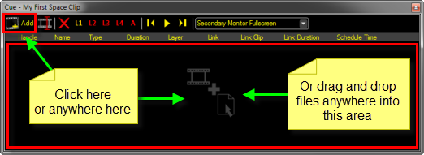

#  Cue List / Space Clip

## What a Space Clip does

A Space Clip is a special type of clip. It allows you to store several clips in one place and play them back from a central location. This may help you better organize your operations in Screen Monkey or you may wish to configure the clips so they play one after another after a certain time has elapsed.

For example, suppose you are using Screen Monkey to manage visuals for a concert with three different groups and several members in each group. You may choose to create a space clip for each group. Inside the Space Clip would be all the media assets related to the group.

If you didn't use Space Clips, your Main Dashboard may look like this:

That's quite a jumble of clips and you would be hard pressed to determine which clip is what when you needed it, no?

Using Space Clips, you are able to easily organize them by group. In this case the Main Dashboard might look like this:

When you play the space clip and open the Cue window, you are able to play the other clips listed in the Cue window. Typically the first clip you have added to the Cue window list will begin playing when you play the Space Clip. And each successive click on the Space Clip in the Main Dashboard advances to the next clip listed.

## How to configure a Space Clip

When you click a slot and choose to add a Space clip, you are prompted to provide a name to identify the space.

Type a name into the field and click OK.

The Space clip is added to the Main Dashboard and the Cue window is displayed waiting for you to add clips.

There are three ways to add clips to the Cue window.

*   Clicking the blank area of the window
    
*   Clicking the Add icon in the window toolbar  
      
    When you click the blank area of the Cue window or click the Add icon, Screen Monkey behaves in the same way it does when clicking an empty slot. It presents a dialog where you choose a Clip type to add. Select the Clip type and click OK.
    
*   Clicking and dragging files into the window  
      
    Files may be dragged from Windows Explorer or you may click and drag clips from the Screen Monkey Main Dashboard to the Cue window.
    

  

A handy tip is that when dragging files from Windows Explorer onto an empty slot in the Main Dashboard, you may press and hold the Alt key as you click and drag. This will cause a Space Clip to be created that contains the selected files. This is a handy shortcut to creating spaces containing lots of clips.

To edit the clips within a space, click once to select them with the mouse so they are highlighted in lavender, then right-click to display the clip menu. You will have the same options as you do if the Clip were in the Main Dashboard. (Transition, Layer, Effect, etc.)

  

Note that Space Clips offer their own layers and the Clips with the Space Clip may also be assigned to individual layers. [Click here](../../tutorials/WorkingWithShows/DisplayLayers.md) for more on Layers.

## How to use a Space Clip during a show

Before any of the items listed in a Space clip will appear, you must click the Space Clip in the Main Dashboard to play it. The clip listed first in the Cue dialog should then appear on the screen or begin playing. (if it's an Audio or Video clip)

After playing the Space Clip in the Main Dashboard, the Cue dialog should be opened. You may wish to open the dialog before actually playing the Space Clip.

To open the Cue dialog, Click the Space Clip using the middle mouse button or right-click the Space Clip and choose Edit / Cue.

The live clip is highlighted in orange and this turns to yellow when the space is playing and the live clip is actually on the screen. You can change the live item by double clicking on a clip.

The Cue toolbar allows you to work with the clips that are part of the space.

  

Clicking the Add button opens the Create Clip dialog so you may add a new clip to the space

Clicking the Edit / Cue button opens the Cue dialog for the clip. This button only works for clips that support cueing, such as Audio or Video.

Clicking the Clear button will clear whatever layer or clip has been selected prior to clicking the button. Perhaps a clip is playing on Layer 3. To clear Layer 3, you would first click L3 to the right of the Clear button, then click the Clear button.

Clicking the layer buttons allow you to choose the Layer to act upon using the Clear button described above.

The Triangle icon starts playing the clip and when play begins the icon changes to a square. At that point it will stop playing the clip when clicked.

Clicking the Profile Selection will allow you to choose the Display Profile used by the Space Clip.