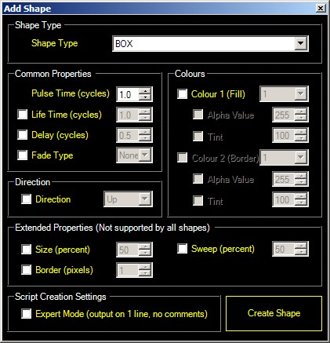
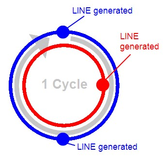

# Creating Custom Effects

This topic explains the concepts relating to the [Effect Generator clip](EffectsGeneratorClip.md) type, and how to create your own effect scripts. For reference information on the effect generator scripting language take a look at the [Scripting Language Reference](ScriptingLanguageReference.md).

## How the Effects Generator works

Effects are made up of 3 parts:

1.  A list of shapes which make up the effect.
2.  A color scheme which determines what colors the shapes will be.
3.  A cycle time which determines how quickly new shapes are created and how long they last.

We will look at how these three things are combined to make an effect in this section.

### Shapes        
Shapes are the building blocks you will use to create effects, each shape supports different parameters which allow its appearance and behavior to be customized. A full list of shapes and the parameters supported by each is available in the [language reference](ScriptingLanguageReference.md).
    
### Color Scheme  
Up to four scheme colors can be used for shapes in your effect, and an optional additional background color (specifying no background color makes the background transparent). Each shape can use 1 or more of the scheme colors, and can optionally specify a tint (darkness) and opacity for the color.
    
### Cycle Time  
When you add a shape to your effect, you have to choose how often it should be generated, this value is specified in cycles. For example specifying an shape generation interval of 1 cycle means that 1 shape will be generated for every 1 cycle. But what is a cycle?  
      
A cycle is an arbitrary length of time which you can change to make your effect go faster or slower: by specifying all the shape intervals in terms of cycles it is easy to make the effect faster (by specifying a shorter cycle time) or slower (by specifying a longer one).
    
## Getting Started

Writing effects scripts can be tricky at first, luckily the editor includes a useful feature called the assistant which allows quick creation of script entries. You can then customize the generated script by editing it.

### Using the Assistant

To access the assistant, right-click the script area:

Each feature has a check box which allows you to decide whether you want the feature included or not, if you do not specify a feature it will keep its default value.

We will add a LINE shape to our effect:

1.  Select shape type LINE from the drop-down list.
2.  Click Create Shape.

The preview window should now show a line moving downward, notice that each line has a random thickness, and one line is being generated every second (because the cycle time is 1 second by default). The script that has been created looks like: 

     LINE(1);

    
This tells the effect to generate a LINE every 1 cycles, this is called the pulse time. Since the shape will by default have a life time that matches its pulse time, a new LINE is generated each time the old one dies.

We can also specify a different life time to the pulse time, the life time is specified by entering it after the pulse time, separated by a comma. Change the script to read:

    LINE(1,2);

Click Update Preview to see the results of this change.

We now have 2 lines on screen at a time because 1 new LINE is being generated every 1 cycle, and each LINE lives for 2 cycles.

All shapes support pulse time and life time, combining these two settings allows you to control the speed of generated shapes, and the number of shapes on the screen at once.

### Creating a color scheme

Creating a color scheme for your effect is as simple as clicking the numbered palette buttons and choosing a color. Do this now by clicking each palette button in turn and choosing a color.

Notice that our color scheme definition has now been added to the script, you can change these numbers if you like, or you can simply use the palette buttons to update them at any time.

The color scheme definitions looks like the this (note that the numbers will be different depending on the colors you choose:

    // Color scheme definitions
    COLOR(250,255,0)         // color 1
    COLOR(255,0,0)           // color 2
    COLOR(255,128,0)         // color 3
    COLOR(0,255,0)           // color 4
    BACKGROUND(0,0,0)        // background

The color scheme can be placed anywhere within the script that you like. Note that for consistency with other scripting languages, the American spelling of 'color' is used for color scheme definitions.

### Assigning colors to shapes

You may have noticed that when you changed color scheme entry number 1, the LINE shape we have already added to our scene changed color to match, this is because by default all shapes use color index 1. So how do we assign a different color to a shape? It's easy!

Shapes can support up to 3 colors, see the table in the [language reference](ScriptingLanguageReference.md) for details: for all shapes the first two colors are the fill color and the border color. To change the color assignments we enter the colors to use in order, enclosed in square brackets and separated with semicolons: For example to use color 2 for fill color and color 3 and border color we would need to add:

    [2];[3];

Add this to your script now, you should have the following:

    LINE(1,2);[2];[3];

Click Update Preview to see your changes.

Now wait a minute? Why did the border of the LINEs not change colour. This is because the default border thickness is zero, we will look at how to fix this by assigning border and other parameters later.

### Adding more shapes to the effect

While it's possible to make a cool effect with a single shape, more often we will want to add more shapes to the effect. Lets add another shape to the effect using the assistant:

1.  Right click the script area to show the assistant.
2.  Choose LINE from the drop-down.
3.  Tick the Direction checkbox and select Up from the drop-down.
4.  Tick the Colour 1 (Fill) checkbox and select 1 in the drop-down.
5.  Click Create Shape.

If all goes to plan you should now have a line travelling up the screen for every two which travel down, notice that the lines going up and the lines going down are in sync.

Our script so far looks like this:

    LINE(1,2);[2];[3];
    LINE(1);
        up;   // direction

Wait a minute! Why is the up parameter on a line of its own? And what does `// direction` mean?

The answer is it's okay to split your shape definitions onto separate lines, but with one rule: each line which forms part of the shape definitions must end with a semicolon.

This means that:

    LINE(1,2);[2];[3];

is the same as:

    LINE(1,2);
    [2];
    [3];

but this will not work as expected since it breaks the rule.

    LINE(1,2)
    ;[2]
    ;[3];

As for the `// direction`, this is known as a comment, and it is a way of leaving notes in a script that provide helpful information - in this case describing the parameter to the left of it. You might notice the comments in the color scheme definition, these help identify which colour is which. You can learn more about comments in the [language reference](ScriptingLanguageReference.md).

### Spicing things up - using delay time

What we have so far is very nice, but the lines are perfectly in sync: each upward line is generated perfectly in time with every other, this is because both are generated at the same time in the cycle, this is represented as follows:

The outer (blue) line represents the first LINE shape, which is generated twice per cycle. The inner (red) track represents the second LINE shape. Notice that the first and second lines are generated at the same point in the cycle. While this is desirable sometimes, other times we may want to make the effect more interesting or make it look more natural by offsetting shape generation.

This is achieved using a third time parameter when specifying the shape, this is added after the life time parameter and is known as delay time.

We will delay our second LINE shape by quarter of a cycle in order to bring it out of sync with the other line object, we will leave the life time as 1 cycle. Change your script to include the new parameter, you should have:

    LINE(1,2);[2];[3];
    LINE(1,1,0.25);
        up;   // direction

Press Update Preview to see your changes, the end result is a system which can be represented as follows:

### Using color tints and opacity

As mentioned above, when assigning colors to shapes, you can also choose a tint and an opacity value, we have already seen how to specify colors by palette number:

    [<number>]    example:    [1]

However, it is also possible to specify an opacity from 0 to 255 where 0 is transparent and 255 is fully opaque:

    [<number>,<opacity>]    example:    [1,128]

You can also specify a "tint value" from 0 to 1 where 0 is black and 1 is full color:

    [<number>,<opacity>,<tint>]    example:    [1,128,0.5]

Let's try it out by assigning a partially transparent color to the upward lines. Add the following at the end of the script:

    [4,120];

You should now have:

    LINE(1,2);[2];[3];
    LINE(1,1,0.25);
        up;            // direction
        [4,120];

Click Update Preview to apply the changes, you should now notice that the upward lines are partially see-through, and when they pass over the downward lines the colors are blended.

## Digging Deeper - Customizing Shapes Using Parameters

While using different shapes allows you to create cool effects, you can also take control of how your shapes behave by using parameters. We have already seen an example of a parameter that changes a shape's behavior above - that is the direction parameter we used to make the LINE move up instead of down.

Before we get started, it helps to know a couple of things about parameters:

-  All shape parameters have a default value. This is the value that the shape will assume if the parameter is not specified.
-  Parameters come in two flavours, flags and parameters:
-  Flags are kind of like a selector switch for your shape that alter the behavior in some way, the direction flag is a good example of a flag parameter. Flags are specified by simply putting the name of the flag you want to use. For example UP, DOWN, LEFT or RIGHT for the direction flag.  
      
Here is an example of a flag:  

    LEFT;
    
Parameters are used to control a value and consist of a parameter name and a value in brackets. The size parameter for example specifies the size of a shape in percentage points:     

    SIZE(50);

This tells the shape's size to be 50% of the screen size.

A full list of parameters is available in the [language reference](ScriptingLanguageReference.md).

### Using the assistant to set initial parameters

To make it easy to experiment and see how different parameters affect different shapes, you can use the assistant to generate parameters for you, and then simply change the values.

Have fun making your own effects!