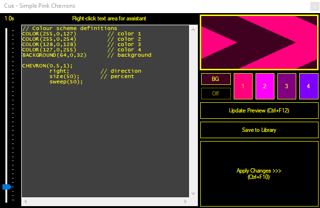

# Customizing an effects clip

While the basic library effects can get you started, you may want to change the effect to customize it for your particular application. Easy customizations you can make are:

- Changing the color scheme and background color
- Changing the effect speed

If you want to make more complex changes to an effect follow the steps outlined in  [creating custom effects scripts](WritingYourOwnEffectsScripts.md).

To begin customizing the effect, you must edit the clip. Right-click the effect clip and choose 'Edit / Cue' from the drop-down menu. The effect editor dialog will appear. It will be filled with the data from the library clip and may look different to the example below.

The effect background can be set to any color desired or removed. Removing the background color results in a transparent background.

You may have to wait a few seconds after changing the color scheme before changes take effect. This is because color scheme changes only apply to new shapes, not shapes that are already on screen.

## To make changes to the effect color scheme

1.  Click the button corresponding to the scheme color you wish to change (1, 2, 3 or 4). To change the background color click the "BG" button. To turn off the background (make it transparent), click the "Off" button.
2.  Select the color from the pop-up dialog.
3.  The preview window updates automatically with the new color scheme, you may have to wait a few seconds.
4.  Click 'Apply Changes' or close the Edit/Cue window to apply the changes to the effect.

## To make changes to the effect speed

6.  The effect speed can be changed by altering the cycle time (also known as pulse time) of the effect. Longer cycle times mean that shapes have longer life-spans and the effect appears slower. Shorter cycle times make the effect quicker.
7.  Move the cycle time slider on the left of the Edit/Cue window until the desired speed is achieved.
8.  Click 'Apply Changes' or close the Edit/Cue window to apply the changes to the effect.