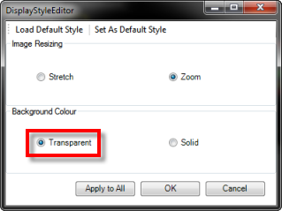

 
# Image Clip

The Image Clip allows you to display a static image on the screen. Any supported image type will be displayed. You may wish to display some graphics or a photo. For example, perhaps you are presenting to a church audience and you know the minister will refer to a certain book during the sermon. You might superimpose an image of the book being discussed so the congregation might more easily find it in the bookstore after service.

Image Clips are a great way to present [Lower Thirds](../../tutorials/WorkingWithClips/CreatingAndUsingLowerThirds.md).

## Configure an Image Clip

When you choose to add an image clip you are presented with a file browsing dialog that allows you to navigate to and choose the image. After the image has been added to a slot, you may right-click it and choose Display Options.

The Display Style Editor dialog is presented.

## Image Resizing

If you choose Stretch, the image is stretched to fill the screen.

If you choose Zoom, the image proportions are maintained and the image is presented at the screen size. (Whichever fills first. Vertical or Horizontal)

When you create images for use in Screen Monkey, it's best if you create them at the exact size of your projection system or device they will be presented on.  
   
For example, many projectors use 1024x768 as their resolution. In this case, optimal results are obtained by configuring images to be that exact size. If you don't, the image will likely be distorted when it is presented as Screen Monkey simply assumes whatever you present should appear on the screen. It has no way of knowing you wanted the image at a specific size or at a specific screen location.  
   
One way to accomplish this is by constructing your image in PowerPoint, presenting that at your presentation size and screen capturing the result for use in Screen Monkey.

### Background Colour

If you choose Transparent for the Background Color and the image is a type that supports Transparency, then it will be rendered with a transparent background when presented. This is useful when presenting something like a lower third where the image is layered on top of live video.

If you choose Solid, the background will typically be rendered as black.

## Use an Image Clip in a show
Presenting images is just like presenting other clip types. You click the image and it shows on the screen until you either fade it out of view or clear the layer it is being presented on.

Some image types (such as .GIF) support animation. If you use a .GIF image type and it is animated, Screen Monkey will only render a static image and the animation will not occur.
