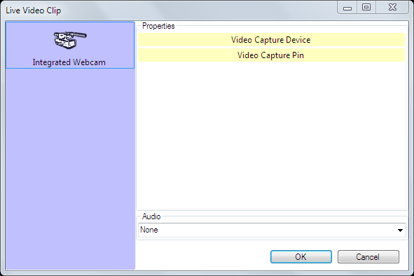

 
# Live Video Clip
The Live Video clip allows you to present a live video feed which is physically connected to your computer. The live video may be obtained from a camera, webcam or capture card. You could use this clip to switch between static graphics and live video or to overlay graphics on live video. Screen Monkey works with most video capture cards and live video interfaces.

## Configure a Live Video Clip
Before this clip can be used you must have some form of live video feed connected to the computer. This probably means you need to acquire and install additional hardware and software in the form of a video capture card or USB interface device. 

Adding the Live Video clip is the same as adding any other clip type. Click on an empty dashboard slot and choose Live Video. The Live Video Clip dialog will then appear.

*Note:* This dialog will show the device(s) physically connected to your computer and it will look different to the example above.

Click on the device you want to use and additional options may then become available. These settings will depend on the device.

Often the settings include a buffer size. The buffer is used to store video frames while the computer processes them. This prevents frames from being dropped when you are capturing to a file. However, when displaying live this buffer may cause a delay. You may need to experiment with these settings to get the best performance from your capture device.

You may also choose an audio input device from the drop down list if required. In many setups it won't be necessary to connect live audio because the audio will be handled separately by a sound mixing desk. 

Once you have made any configuration changes required click OK and the Live Video Clip will be added to the dashboard.

## Use a Live Video Clip in a show
Using the Live Video is as simple as clicking the icon. You click the icon and the Live Video feed will appear on the output. You can fade a Live Video feed in and out as needed using the [Layers Dashboard](../layers.md).
