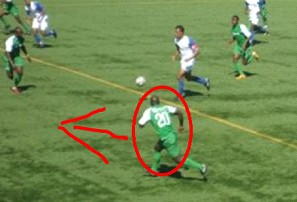
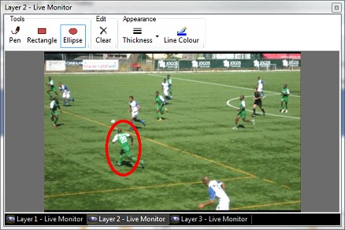

# Scribble Clip

The scribble clip allows you to freehand draw on the screen. The drawing is overlaid on top of any video or media playing on other layers. There are a number of applications for this, such as in classrooms where the teacher want to highlight a specific part of a video or during live commentary where the commentators want to point out a specific part of a replay.

## Create a Scribble Clip
To adding a Scribble Clip, Click or Right-click an empty slot and choose Scribble. Ensure the Scribble is assigned to a Layer that sits above your video or whatever you will be live annotating. Otherwise, the Scribble will replace the video or whatever is being annotated if the Scribble Clip is simply configured to use the Active layer.

Other configuration will occur during actual use of the Scribble Clip, where you may choose pen color, shape and thickness.

## Use a Scribble Clip in a show
To begin using the scribble, click the Scribble Clip to play it. You must also open the [live monitor](../../tutorials/WorkingWithShows/LiveMonitor.md) to gain control of your pen including color, shape and thickness. You may use the Clear button to remove all your doodles and start over.

When using the Scribble Clip you may also want to use the [Freeze](FreezeClip.md) or [Live Video Snapshot](LiveVideoSnapshotClip.md) clip. Or you may find it simpler to just pause the video if playing back [Video](VideoClip.md) or [DVD](DVDClip.md).
