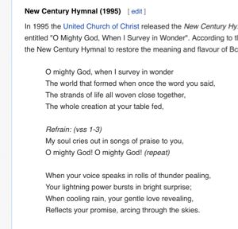
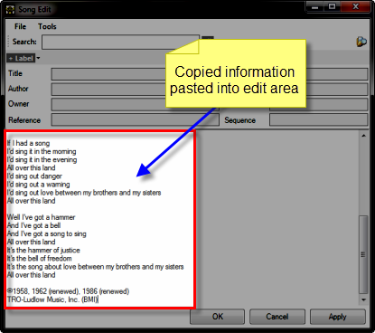
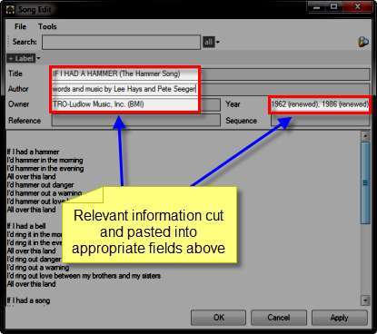
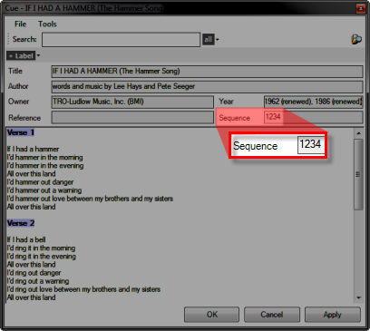
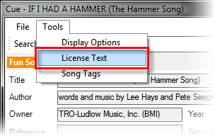
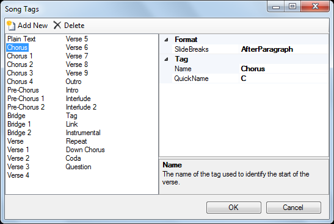
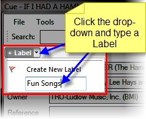
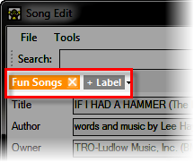

# Creating A New Song

To add a completely new song clip, click any empty Dashboard slot and select Song from the new clip browser. Alternatively you can search for an [existing song](SongSearch.md) on your computer.

The steps for creating a new song are as follows.

1. [Type or paste the lyrics](#type-or-paste-the-lyrics)
2. [Add the section tags](#add-the-section-tags)
3. Check and update the sequence
4. Add metadata
5. Add labels
5. Save an XML file

These will be explained in detail below.

## 1. Type or paste the lyrics
Initially the song dialog will be empty.

You can start typing the lyrics into the large white area however if the song is available online it will be quicker to copy and paste from a website. Make a quick google search for the lyrics of the song you wish to add and copy-paste them into the clip. For example, if we search for 'How Great Thou Art' then we find this [wikipedia page](https://en.wikipedia.org/wiki/How_Great_Thou_Art) from which we can copy the lyrics.

Now paste the copied text into the song clip edit dialog.

## 2. Add the section tags
Next we should prefix each verse, chorus or part with a section heading tag. By prefixing with tags we are telling Screen Monkey how elements are to be presented when we play the clip later and making it easier for us to jump around the song in playback if required.

Screen Monkey has a lot of tags pre-configured for you. [View a list of default song section tags online](SongTags.md) or use Tools > Song Tags to open a new dialog. These tags should be sufficient for most circumstances but you can [edit them](#edit-song-tags) if required.

Place the cursor before each verse and type the tag name to identify the sections of the song, for example 'Verse 1'. Note that after you type the tag it becomes bold and shaded. Case is not important when typing the section tags. Screen Monkey will not care if you type verse 1 or Verse 1. It will recognize the tag either way.

Notice that as you add the tags to indicate the verses the Sequence field becomes populated automatically.

## 3. Check and update the sequence

We will examine this in more detail later.

We will rearrange a bit by cutting and pasting elements from the main area into the respective fields above.

## Save an XML file
It's a good idea to save all your songs to a dedicated common folder intended for only songs. This will come in handy if you want to use the [Song Search](SongSearch.md) to reuse songs later. 

There is no requirement to save songs as separate files if you have no other use for them. Once they are on the dashboard they are included in the showfile and will reload with Screen Monkey.

If you wish to Save simply use the File > Save As option from the menu at the top of the song clip dialog. Save the Song using an appropriate name and in the location you wish. 

Click OK to dismiss the Song Edit dialog, then click the Song clip to play it. Clear it when finished.

Now you have a song created it's time to [learn how to configure the format and style of the song clip](SongDisplay.md).

## License Text
You may add your CCLI number or copyright details for songs. This is a global Screen Monkey setting for your installation and not associated with a particular song.

From within the song clip editor choose 'Tools > License Text'.

The License dialog is presented. Enable the Show license checkbox and type the text into the field provided.

Click OK to save. In order for the licence to appear on screen it may need to be enabled in the [Song Display Editor](SongDisplay.md).

## Edit Song Tags 
There are 33 [song tags available by default](SongTags.md). You may change these tags or add additional tags to the list. Each tag requires a Name which is used in the song body to identify the section and a single character QuickName identifier which is used in the sequence code. Each tag also has a slide break setting. 

To create your own tags. Open any song for editing and from the Tools menu select 'Song Tags'. 

# Working With Labels

When you create Song Clips you have an ability to create Labels. Labels are a handy way of finding Songs later. For example, for a church setting you may wish to define a Label of Christmas songs. Then associate it with all the different songs using a Christmas theme. Or perhaps Easter. Or perhaps you are presenting song lyrics at a concert. You could define labels by the group that will be performing.

Labels can assist when you need to [Search for songs](SongSearch.md).

## To associate a label with a song:

Open the Cue / Edit dialog for the song by clicking the middle mouse button or right-clicking and choosing Edit / Cue.

Click the Label drop-down and give the song a Label.

Press Enter after typing the Label and the dialog should change a bit.

You may repeat this process to add as many labels as needed.

Click OK after adding the label and Screen Monkey should issue the following prompt:

Click Yes to save the updated song.

After you have added Labels, you may then use them when [Searching for Songs](SongSearch.md).

## To remove a label

A label is removed by clicking on the cross next to the label name.

