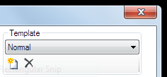
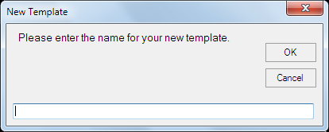
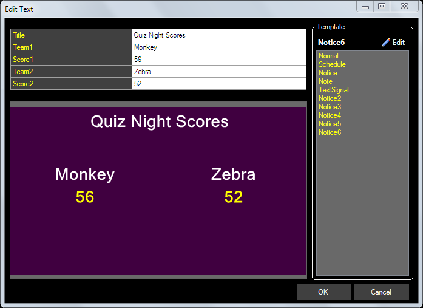

# Text Clip

The text clip allows you to display text and graphics on screen using pre-defined templates. The text clip template is created from a library of [caption objects](TextClipObjects.md) and is really very powerful. Some text clip objects can update their content whilst the clip is live.

By creating templates the text clip content can be easily changed but the design and layout stays the same. Multiple clips can be created from the same template which makes it quick and easy to have several versions or instances of the same text clip.

*Note:* Text clip templates are not lost when you create a new show.

There are a few steps involved in creating and using text clips. Not all these steps will apply to all use cases.

- Create a new template or modify an existing one
- Create the text clip from the template
- Enter any data required by the template
- Configure the text clip
- Use the text clip in a show
- Interact with the live clip using the preview window
- Change the text clip

These steps are described below.

## Create a new template
A new template is required for each layout that you wish to use in the show.

- Add a new Text Clip by clicking an empty slot and choosing Text from the new clip dialog.
- A dialog will appear with one default template called 'Normal' and any other templates that have been created on your computer.
- Click the 'Edit' pencil icon to open the Display Style editor
- Click on the 'New' icon on toolbar in the template section   

- Enter a template name   

- Press Enter or click OK

Your new template is now ready for you to design. Learn more about how to use the [Display Style](TextDisplay.md) window to edit templates.

## Modify a template
Existing templates can be modified or used as a starting point for new templates. Using the [Display Style](TextDisplay.md) window select the template you wish to modify and then make your changes.

To create a new template based on an exising design first select the template you wish to copy and then click the new icon. Enter a name a click ok. The new template will be available.

## Create a Text Clip
Create a new text clip and choose from the list of templates on the right hand side of the dialog. You can also pick a new template for an existing clip by right-clicking the dashboard icon and selecting Edit/Cue.

## Configure Text Clip template data
The edit data dialog appears when you create a new text clip or when you open the Edit/Cue dialog for an existing clip.

The default template allows you to enter a piece of text to be displayed on screen in the white box labelled 'Main Text'. If you type some text and press Enter the preview will update to show how the clip will appear. Click OK and then play the clip to see how it appears on the output.

If you add more [text caption objects](TextClipObjects.md) to the template then they will appear in this dialog. In the example below 5 text clip objects have been added to the template. These data fields can be edited at any time, even while the clip is live, and the output will update immediately.

## Configure the Text Clip
Once the clip is created you are able to configure it like any other clip. You can add transitions, links, rename and update the thumbnail by right clicking on the clip icon on the dashboard. These options are described fully in [clip settings](../../clipSettings/clipSettings.md).

## Use the Text Clip in a show
Using the text clip is just like any other - you left click the clip to display it. Depending on the text caption objects used the output could be static or dynamic.

## Interact with the Text Clip
Some text clip objects add controls in the [preview window](../../toolbar/preview.md). For example the countdown [caption objects](TextClipObjects.md) are operated from the preview window. For each countdown object in the clip you will see a time field, reset button, play/pause button and increment and decrement buttons.

## Update the Text Clip
If you wish to change the template associated with a clip you may right-click the clip and choose Edit / Cue to select a different template to apply. From this dialog you can also update data fields whilst the clip is live.
