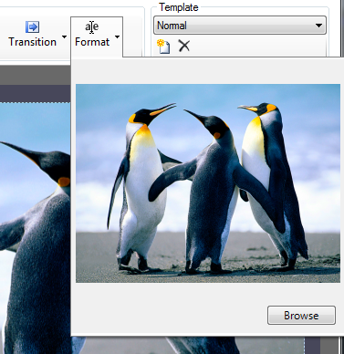
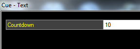
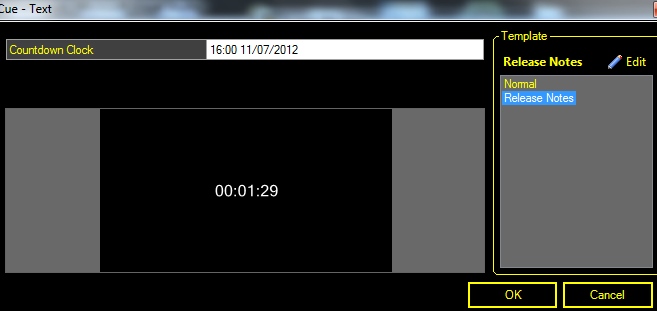
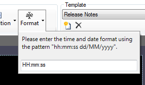
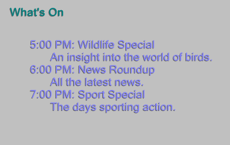
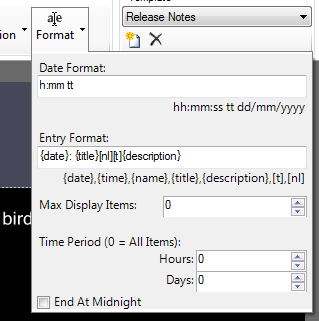
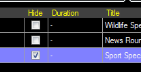
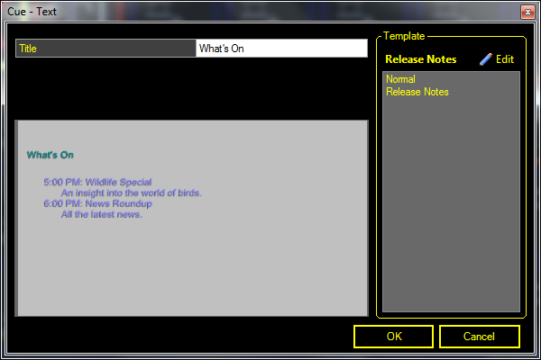
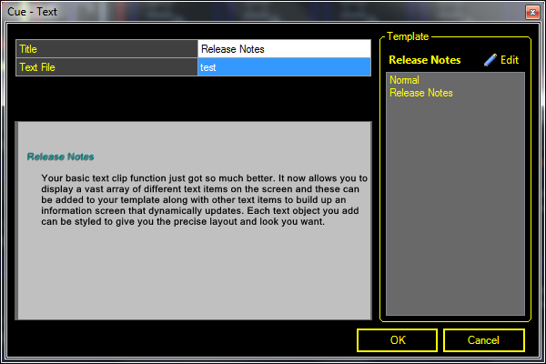

# Text Clip Caption Objects

The text clip contains a library of useful caption objects which can be added to the template to create a text clip for almost any situation. 

## Adding a new Caption Object
From within the Text Display Style dialog click on the 'Objects' button and select the object you wish to add from the dropdown menu. You will be asked to give the new object a name which is used to identify it in the captions list. Enter a name and click OK. The new Cpation will appear in the list and on the preview canvas with its default settings. Objects can be added multiple times with different names and configured differently. 

## Removing a Caption Object
Select the caption and then click the black cross button at the top of the caption list.

## Configure a Caption Object
The caption objects are configured by clicking the caption name in the list on the left of the dialog and then using the Toolbar buttons.

The toolbar buttons which apply to most objects are described here. For all other settings refer to the appropriate section below. 

|Item|Description|
|-|-|
|Font|Click here to change the Font and style (bold, italic, etc) of the selected caption.|
|Colour|Changes the text colour of the selected caption.|
|Align|Clicking this box gives you nine alignment options for aranging the text within the frame. The icons give an indication of how the text will be laid out.|
|Margin|Allows you to set the four margins (top, bottom, left, right) from the edges of the screen to the selected caption frame.|
|Effect|This section gives you two effect options - Drop Shadow and Outline. Both are configurable in terms of opacity and colour. To disable the Drop Shadow set the Opacity to minimum (far left).|
|Transition|You can set the time taken for the caption to transition (disolve) from one page to the next. There are four speed options None, Fast, Medium and Slow.|
|Format|The format options differ for each caption type as described below.|
|Visible|Enable or disable the selected caption from being displayed.|

## Text
Displays formatted text to the screen.

|Item|Description|
|-|-|
|Display Format|The default placeholder string `{0}` means that the text for this object is set in the Edit/Cue dialog of the Text clip. By modifying this string you can add static text saved in the display profile. This is helpful if you want to specify text that won't change and then allow dynamic input of text through the clip Edit/Cue dialog.|
|Example|In the template you might specify the following display format "Next seminar is starting in {0}" and then in each Text clip that you create you input the location text "Downstairs Hall", "Meeting Room 3", etc in the Edit/Cue dialog. When the clip is played {0} is replaced with the text from the Edit/Cue dialog.|

## Live Text

## Image
The image object allows you to insert images and logos into your text clip template.

|Item|Description|
|-|-|
|Format Browse|The toolbar format button allows you to browse for an image file. Use the margins and alignment toolbar options to position the image.|
|Note|The aspect ratio of the image will be preserved when the clip is played even though it may appear stretched on the preview canvas depending on how you set the margins.|

## Countdown
Provides a live onscreen countdown from the number you specify.

|Item|Description|
|-|-|
|Format|Use a [pattern to format the displayed time](DateTime.md)|
|Reset on Clip Play|
|Count Past Zero|
|Warning|
|Alert|

## Countdown Clock
Generates a realtime onscreen countdown showing the time remaining to the time you specify.

|Item|Description|
|-|-|
|Format|[Use a pattern to format the displayed time](DateTime.md)|
|Reset on Clip Play|
|Count Past Zero|
|Warning|
|Alert|

## Stopwatch
Provides an onscreen clock which counts up from zero in realtime, starting when the clip is played.

|Item|Description|
|-|-|
|Default|HH:mm:ss|
|Format|[Use a pattern to format the displayed time](DateTime.md)|

## Schedule

## Text File

## Date/Time
Using the Date/Time caption object you can display the current date and/or time live on screen. The format of the time and date is specified using the standard formatting codes and can be combined with static text. 

|Item|Description|
|-|-|
|Default|h:mm:ss tt dd/MM/yyyy|
|Format|[Use a pattern to format the displayed date and/or time](DateTime.md)|

## Notice Pages

## Notice List

Countdown

You can use this object to display a countdown from a specific number.

Once you add the countdown object it will display "\[Invalid Countdown\]" until you configure the text to a start number in the clip's settings.

Once you have set the start number, it will count down from this value each time you play the clip.

[Click here for a step-by-step guide on creating a Countdown clip](../../../tutorials/WorkingWithClips/CreatingACountdown.md).

Countdown Clock

Similar to the Countdown, this object also allows you to display a countdown on the screen. The difference is that with this object, you can specify an end date or time to countdown to. Once you have set the target time, the clip will continuously show a countdown to this time on the screen when the text clip is playing.

When you add the Countdown Clock it will display \[Invalid Time Format!\] till you set the target time. The target time is set through the clips edit panel.

You can change the format of the countdown from the template editor by selecting format.

Please see the [Date and Time](#Date_and_Time) object settings for details on the date and time format.

Schedule

Using this object you can display the current clips scheduled for playback in a text clip. This is a great feature when running an automated TV station and you want to display the next programs to be shown during a break. The layout and format of the schedule items is fully customizable. The title and description for each item can be set in the scheduler.

Once you add the schedule object to your template you can use the Format tab to configure how each item is displayed and what items are displayed.

  

Date Format

Determines the format to display the start time of each scheduled clip. Please see the [Date/Time](#Date_and_Time) object for details on how to specify the format.

Entry Format

Specifies how each scheduled item is displayed in the list. Special tags allow you to insert information from the scheduled item.

{date} - the start date for the scheduled item.

{time} - the start time for the scheduled item.

{name} - the clip name.

{title} - a special field set through the scheduler for each scheduled item. This is initially blank for each clip and you must set through the scheduler. You can use this to display a different title from the clip name.

{description} - a special field set for each clip through the scheduler.

When you use the {title} or {description} tags you need to ensure you set the text through the scheduler. You can open the scheduler by clicking on the clock icon in the main dashboard. The scheduled items list will open and contains two columns for the title and description. You can enter your text here.  
  
  
  
The default is to hide scheduled items from display in the scheduled object. This ensures that while you add scheduled items they are not visible. To show the item and display them in the text schedule you need to open the scheduler and clear "Hide" for each scheduled clip. Without doing this, the schedule will appear blank.  
  
  
  
The following shows a template which has a title with a schedule item.  
  

You can also add a limited set of formatting.

\[t\] - add a tab

\[nl\] - new line

Max Display Items

The number of scheduled items to display at a time.

Time Period

The amount of time to look ahead in the schedule for items to display. setting to zero will display all scheduled items.

End At Midnight

Only displays scheduled items till midnight of the day specified in the Time Period property.

Text File

Using the text file object you can display the contents of a text file within the text clip. All the text from the file is displayed using the template's formatting.

Once you add the Text File object you then need to select the text file to use. This is done by clicking the format tab and selecting Browse. You can now select the file to display. The text file can be created using applications such as Windows Notepad. Once you select the file it will show you the text that is going to be displayed.

The text file is constantly being monitored for changes even when the clip is live so any changes you save to the file will be immediately updated on the screen. This can be helpful if you want to update the text over a network as you can update the file remotely to change the text being displayed on the screen.