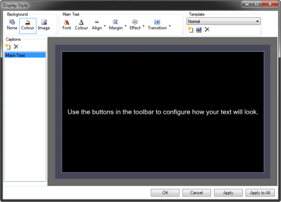
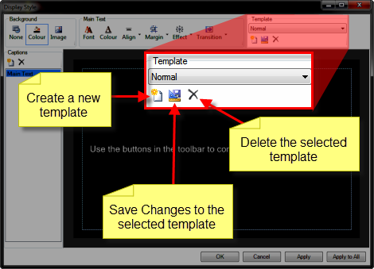
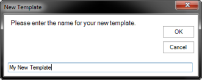
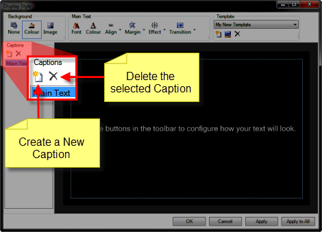
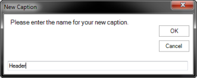
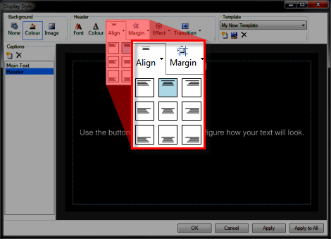

There are four main areas

- Toolbar along the top which is split into sections for background, selected caption settings and template
- Caption list down the left hand side where you create [text clip objects](TextClipObjects.md)
- Preview canvas in the remainder of the window
- Bottom row of buttons

These areas are described in detail below.

The Display Style dialog should open and offer many options that are used to configure the appearance of the text.

All settings are stored inside Templates. So it's only logical that you would first define a Template and configure it from there.  If you are wondering why the dialog has the different colored areas, [click here](http://en.wikipedia.org/wiki/Title_safe).

Click the New Template icon.

Type a name to identify the template and click OK.

After you have created the template you need to configure it. Notice that your new template already has a Caption named Main Text. Let's add new Captions.

Click the New Caption icon.

Type a name to identify the caption and click OK.

You may add any number of captions. Captions simply define where any text assigned to these fields will appear. In the example above, we named our Caption "Header". As you might imagine, we want the caption to present a heading as well as to be aligned at the top of the display and centered. For this, we select the Header caption in the Captions list, then click the Align icon to choose the desired alignment.

Note that you may also configure the Font, Font color, Margins, Effect and Transition in the formatting area. These options are pretty intuitive and should need no further explanation.

If you look at the Background section, note that your options are:

  

None

This option removes any Color or Image that has been selected.

Colour

This option allows you to choose a color to be used for the background.

Image

This option allows you to choose an image to be used for the background. Note that the image will simply be scaled to fit.