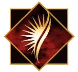
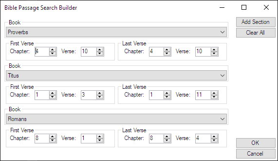
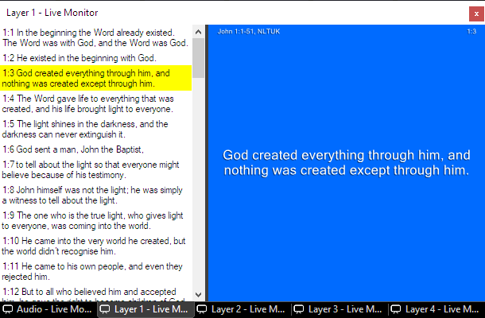

# NLT Passage Clip

The NLT clip allows you to very easily show texts from the New Living Translation Bible. The clip allows you to search for a passage and then add it as a new text clip. Multiple passages from different books or chapters in the Bible can be added to the same clip. 

*Note:* There is a different clip type for [ESV Bible Passages](esv.md).

*Note:* The NLT clip uses an online database. An internet connection is required to add new passages. If you save a show containing NLT clips then an internet connection is not required for playback.

## Create a NLT Passage Clip
Click on any empty dashboard slot and choose NLT Passage. You will be presented with a dialog that allows you to search for the passage or passages you wish to display in the clip. A single clip can be split into multiple pages and contain one or more passages.

### Basic Searching
For a single passage use the search bar at the top of the window. Type the Bible reference you require and press Enter. You may search as follows:

- for a single verse, eg `James 1:5`
- for a range of verses, eg `John 4:5-10` or `Luke 1:8-2:12`
- for a chapter, eg `Matthew 4`

### Passage Search Builder
If you need to present multiple passages in a single clip then use the Passage Builder. Click the three dots to the right of the search field and a new dialog will open. Here you can choose multiple books, chapters and verses. Start by entering your first passage start and end. Then click 'Add Section' and repeat for the next passage. Keep adding as many sections as you need then click OK.

Once you have the passage(s) you require in the clip cue dialog press OK and a new clip will appear on the dashboard. 

## Configure a NLT Passage Clip
If you right-click on the dashboard clip icon there are a few menu options specific to this clip. 

- **Start Slide** Choose on which slide to start the playback. This allows you to skip the 'Passage Title' screen or start at any other position if required.

- **[Playback Settings](../clipSettings/playbackSettings.md)** For the NLT Passage clip 'Auto Rewind' is enabled by default.

- **Display Options** Configure the style and the format of the clip. Refer to the [Song clip](Song/SongDisplay.md) and the [Formatting](#formatting) section below for details.

- **Edit / Cue** change the Bible passages to be displayed.

## Use a NLT Passage Clip in a show
Playback works in a very similar way to [song clips](Song/SongClip.md). Activate the clip by left clicking on the dashboard icon in the normal way. Then step through the text pages by either left clicking repeatedly on the clip icon or choosing a text section in the [live preview](../toolbar/preview.md) monitor.

## Formatting
In a similar way to [Song](Song/SongDisplay.md) and [Text](Text/TextDisplay.md) clips the text formatting, layout and background of the NLT passage can be changed by right clicking on the clip icon in the dashboard and selecting ‘Display Options’. The following items are specific to this clip type. 

- **Verse Number** displays the verse number of the displayed text, for example ‘John 1:4’. 

- **Passage Reference** displays the reference for all passages included in the clip, for example ‘John 1:1-2:10’

Both of these are optional, to hide them choose ‘Hide’ from the ‘Visible’ toolbar item. For all other display settings refer to the [text clip](Text/TextDisplay.md) pages.