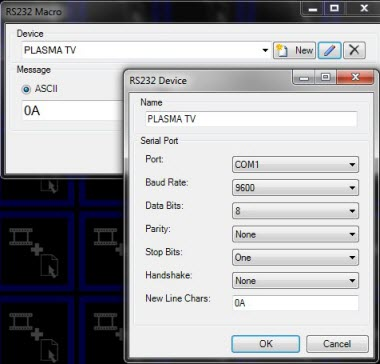
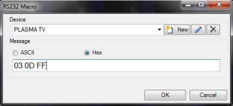
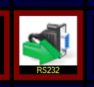

# RS232

You add the macro by clicking on an empty slot and selecting ‘Choose Macro...’ you then double click on the RS232 macro.

The first time you add a RS232 macro for a piece of equipment you need to enter the settings for talking to the RS232 device. Please refer to the documentation of the device for details on what these settings should be. You must also enter a friendly name to identify the device. Click OK to save the device parameters.

   
You will now need to enter a control message to send to the device that will perform a specific action such as turn on or turn off. You have the option to enter commands in either ASCII or Hex format. Please refer to the device's documentation for a list of commands you can send to the device.

When you are finished click OK and the macro will be added to the clip slot. Whenever you click the macro the RS232 message will be sent to the device.

You can continue creating command clips with different control messages by reusing the device settings.
