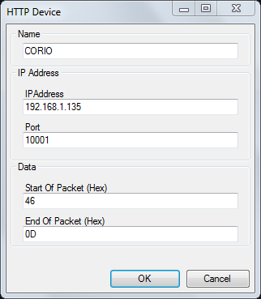
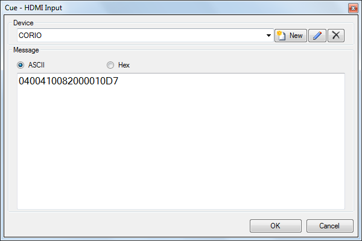
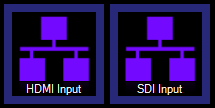

# TCP

The TCP macro allows you to communicate with devices and send commands using Transmission Control Protocol (TCP).
 
The device you wish to control must have an IP address and be configured so that Screen Monkey can connect to it on your network.

Enter the correct IP Address of the device you want to talk to on the network. You also need to enter the correct Port and optionally start and end of packet bytes. This information will be found within the documentation for the device you want to control. Also enter a name to identify the device and click OK.

The example below is for a TVOne Corio.

You will now need to enter the message you wish to send to the device. You can either enter it as an ASCII string or a Hexadecimal string. Details of the messages you need to send will be found in the documentation of the device you wish to talk to. 

In this example the command will switch the primary input to HDMI.

When you are finished the macro will be added to the clip panels and the message you entered will be sent every time you run the macro.

