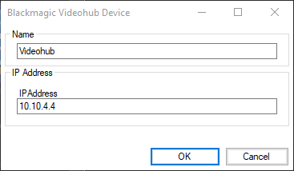
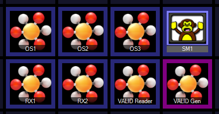

# Blackmagic Videohub
The [Blackmagic Videohub](https://www.blackmagicdesign.com/products) range of video routers can be controlled by Screen Monkey using macros. A Videohub macro clip sends a single crosspoint to the router (one source to one destination). Multiple Videohub macro clips are therefore normally required to build useful functionality.

## Prerequisites
The computer running Screen Monkey needs to be able to access the Videohub router(s) through a network connection. You will need to set an appropriate IP address on the router. 

The [Blackmagic Videohub software](https://www.blackmagicdesign.com/support) is required to be installed on the computer. This is a free download from Blackmagic Support website.

Screen Money will display the source and destination names set in the Blackmagic software but it cannot change them, therefore you should use the Blackmagic software to name the sources and destinations if required.

## Creating a new Videohub device
Before you can make Blackmagic macro clips the router must be added as a device to Screen Monkey. To do this create a new Videohub clip and then click 'new' in the device section which will open this dialog where you enter the name and IP address of the router.

Screen Monkey can control multiple routers. Click ‘new’ and set a name and IP address for each router you wish to control.

## Creating a new Videohub clip
Once the router is connected Screen Monkey will display the list of sources and destinations. These labels are set in the Blackmagic software. To create a new macro clip choose the source and destination you wish to connect. A Videohub macro clip contains only one crosspoint.

Videohub clips are added to the dashboard with automatically generated names. These can be [renamed](../clipSettings/rename.md) to anything you like. It is also possible to change the thumbnail as seen below. 

To send the crosspoint command to the router simply left click on the macro clip. The purple outline will always highlight active crosspoints regardless of where those crosspoints are changed. If a crosspoint is changed on a BlackMagic hardware panel then Screen Monkey will immediately update to show this. Videohub clips may have [links](../clipSettings/link.md) to or from other clips and be [scheduled](../toolbar/schedule.md) to execute at a predetermined time which allows for powerful automation systems to be built. 

