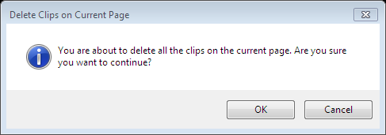

# Using Pages

As you begin working with Screen Monkey, adding clips and playing shows, you will likely find that you need more space to work. When you add clips to the dashboard you add them to slots. The slots you initially see are all on Page 1. There are many more pages available which can be used when you need more space or want to separate clips for any reason. The number of slots you have available on a page depends on a couple of different factors - page stride and window layout.

You may find that it’s helpful to add clips to specific pages in order to organize them. Perhaps you have a group of several music clips used during offering at a [church service](../start/UsingForAChurchService.md). You might place all those clips on a specific Page. Or if you are working on a [concert](../start/UsingForAConcert.md) perhaps you want to organize all the information for each act on different pages.

## Page Numbers
In the top right of the dashboard you will see a row of numbers. These are the page numbers. The number shown in bold white is the current page.

## Page Layouts
Screen Monkey offers three different page stride options which can be chosen in [General Settings](Settings/General.md). 

|Setting|Description|
|-|-|
|Dynamic |The number is slots per row and page adjusts depending on the size of the slot icons and the size of the dashboard window. Clips automatically flow between pages as required when the window is resized.|
|100, 256|Every page is fixed at 100 or 256 slots, the number of slots per row is dynamic depending on window size. Clips will not automatically flow between pages unless you are inserting new clips at the very end of the page and you run out of space. The 256 clip option is specifically useful when controlling Screen Monkey via DMX as it ensures that each page fits on a DMX channel.|

## Changing Pages
There are a few ways of navigating the pages.

- Click on a page number to jump to that page
- Click on the plus or minus icons to move up or down    
- Press PageUp, PageDown to move up or down
- Press Home to go to page 1
- Use the bookmarks to quickly jump to a named page
- Clicking the bold white page number in the page numbers bar will open the Goto Page dialog where you may type a new page number to jump to

## Bookmarking Pages
A page can be given a bookmark so rather than ‘Page 1’ it will show something more meaningful to your way of working. Bookmarking pages makes it easy to find what you need when you need it. A page with a bookmark retains its original number, so all navigation methods described above still work, the bookmark is an additional way of navigating. Before choosing bookmarks you should ensure you have configured the Dashboard of Screen Monkey to the size you are comfortable using and have organised your clips so they are logically grouped into pages.

In the top left corner of the Dashboard we see the bookmark drop-down, currently showing ‘Page 1’.

Just to the right of the drop-down list is the Bookmark rename icon. Click this icon and the Bookmark name dialog is presented. Type your desired name into the field and press Enter or click OK.

To change the name just click the rename button again.

Bookmarks make it a simple and efficient process to organize and navigate to exactly the clips you need when you need them. Now you can use familiar names in the drop-down list to move to pages instead of having to memorize page numbers.

## Clearing Pages
To quickly tidy up a page and remove all clips click on the 'Clear Page' icon next to the rename icon in the page toolbar.

Screen Monkey will ask if you wish to proceed. 

Choose 'OK' and any clips which are not [pinned](clipSettings/pin.md) will be removed. 

*Note:* The **original** clip in a pinned set it is removed by the page clear commnand.