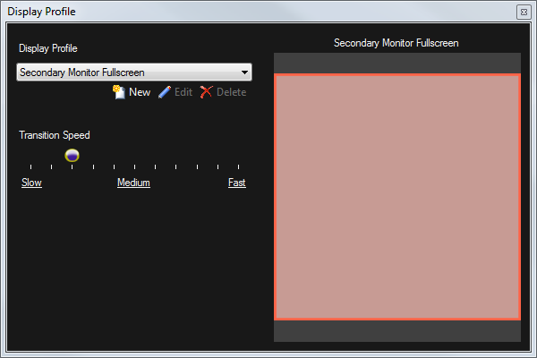
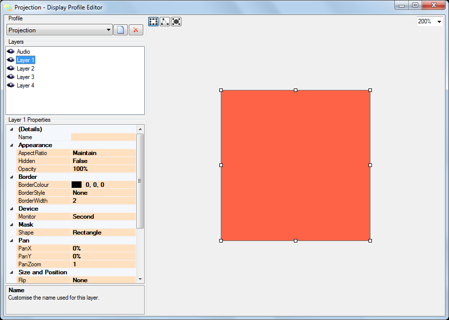
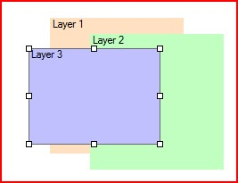
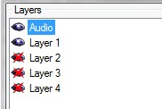
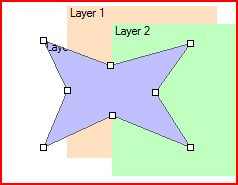

 
# Display

Display Profiles are very important and allow you to configure physical monitor outputs and display rendering for Screen Monkey.

You can either choose from one of the pre-defined profiles or create your own. Each profile defines the size, position and physical monitor connection that each [layer](../layers.md) is presented on.

## Display Profile Window
Click the Display button on the toolbar to open the Display Profile window. Here you can select a profile to use and adjust the transition speed. The transition speed you set here is used by the ‘Fade’ buttons in the [layers dashboard](layers.md).

## Monitor Outputs
Screen Monkey will use any displays visible in Windows display settings. The displays are defined as follows.

|Windows Display Device|Screen Monkey Name|
|-|-|
|1|Primary|
|2|Secondary|
|3|Monitor3|
|4|Monitor4|
|5|Monitor5|

## Pre-Defined Profiles
These pre-defined display profiles are installed with Screen Monkey and cannot be edited.

|Name|Description|
|-|-|
|Dmx Control|Screen Monkey will output on DMX only|
|Primary Monitor 50%|Media output in a 50% window in the centre of the primary monitor|
|Secondary Monitor 50%|Media output in a 50% window in the centre of the secondary monitor|
|Primary Monitor Fullscreen|Media output filling the primary monitor|
|Secondary Monitor Fullscreen|Media output filling the secondary monitor| 
|Primary Monitor Picture In Picture|Layer 1 in the background with a scaled Layer 2 and Layer 3 on top on the primary monitor| 
|Secondary Monitor Picture In Picture|Layer 1 in the background with a scaled Layer 2 and Layer 3 on top on the secondary monitor|

To use one of these profiles select it from the dropdown list and it will be applied immediately. Adjust the transition speed if required.

## Display Profile Editor
If you want to create your own profile you can do this in the profiles editor. Just click on the ‘New’ button in the display profile window and enter a name for the profile. Click OK or press Enter and the display profile editor will open. 

Either change the settings from the properties list on the left hand side or use the mouse to drag and resize the layers on the screen view. As you select each layer the properties will update to show the selected layer.

## Layer Settings
Each of the layers has the following settings you may configure. Note that these settings are applied in realtime so its easy to get the layout you require but they should not normally be adjusted live during a show.

- **Name** allows you to enter a name for the layer which will appear in the left hand panel of the main window.

- **AspectRatio** determines how content which does not fit the layer dimensions is resized to fit. When set to maintain the media will be resized but the aspect ratio will be maintained and you may get black borders at the sides or along the top. When set to stretch the media will be stretched to fit the layer.

- **Hidden** determines whether the layer is displayed or not. This property will not update live, recue the clip to see the effect.

- **Opacity** allows you to make the layer semi-transparent.

- **BorderColour** If the border style is set to solid this is the colour of the border placed around the layer. *Note:* Borders are not supported for the video clip in the stardard renderer.

- **BorderStyle** Set to solid to place a border around the layer or none to have no border. *Note:* Borders are not supported for the video clip in the stardard renderer.

- **BorderWidth** The width of the border placed around the layer.

- **Monitor** choose the monitor (display device) for this layer.

- **Shape** allows you to choose from either rectangular, eliptical or polygon. Each changes the shape of the layer. When set to polygon you can use the edit view to create any shape you wish.

- **PanX** pans the image left/right within the layer.

- **PanY** pans the image up/down within the layer.

- **PanZoom** zooms the image within the layer.

- **Flip** the layer either horizontally or vertically.

- **Height** adjusts the height of the layer as a percentage of the whole screen. A height of 50% will mean the layer height is half the height of the screen.

- **OffsetX** - the horizontal offset from the center of the screen as a percentage of the screen width. A negative offset will result in the layer shifting to the left on the screen and a positive offset will result in the layer shifting to the right.

- **OffsetY** - the vertical offset from the center of the screen as a percentage of the screen height. A negative offset will result in the layer shifting to the top of the screen and a positive offset will result in the layer shifting to the bottom of the screen.

- **Rotation** allows you to rotate the layer a specified number of degrees.

- **Width** adjusts the width of the layer as a percentage of the whole screen. A width of 50% will mean the layer width is half the width of the screen.

- **Zoom** proportionally scales both the width and the height as a percentage of the screen dimensions.

- **Volume** adjustment level for any audio playing on the layer.

## Editing a Layer’s Shape
The easiest way to edit a layer’s shape is in the editors preview. The default shape for a layer is rectangular and you can click on a layer to adjust the size and position of the layer within the screen.

There are two other shapes for a layer which you can select from to give you the type of clipping you require. With the polygon shape you can define almost any shape you wish and this gives you a lot of flexibility.

You will notice that when you select a layer by clicking on it, some tool buttons will appear in the top left of the editor. You can use these to select the shape you wish.

Once you have selected your desired shape, use the mouse to adjust it. You may want to turn the visibility of a layer on or off to make it easier to see the layer you are editing. To make a layer invisible, you click on the eye icon in the layers list.

When in polygon mode you can create a new point just by clicking on the line where you want the point to appear and existing points can be dragged around. To remove a point just double click on it.

## General Settings
The display profiles can also be changed and edited in Screen Monkey [General Settings](../Settings/General.md).

