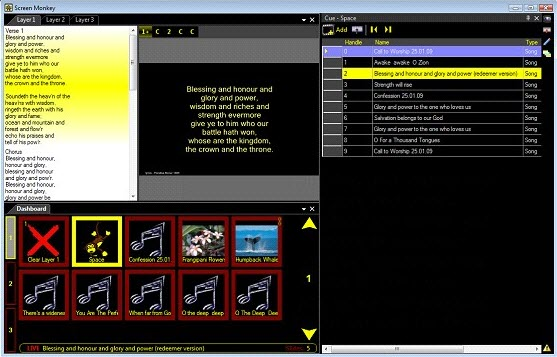
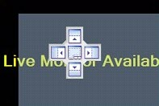
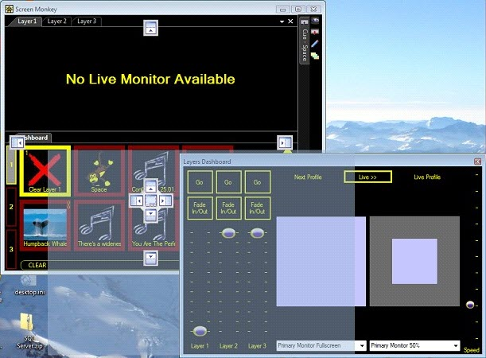

# Window

Screen Monkey allows you to show, hide, pin and dock almost any part of the user interface in any location. It is possible to make unlimited different views to suit any use case. The Window menu accessed from the toolbar allows you to recall, save and manage views.

To make it easy to switch between different layouts or restore a previous layout you can save your window positions to a view. It is then simple to restore those layouts with one button press. You restore a Window layout by selecting the desired view from the Window menu. All the windows move to the position at the point when you saved the view.

## Menu items
There are a number of sub menus which are described below.

## Live Playback

## List Playback

## Scheduled Playback

## Customize
To save a view, arrange the windows in the positions you want, then click Window and choose Customize. The Manage Views dialog appears which allows you to add or remove your own saved views. To save the current view click ‘New’ and enter the name you want to give to the view. Your new view will now appear in the toolbar Window menu.

To remove views place a tick to the left of the view name you wish to remove and then press ‘Delete’.

## Lock Layout
Select this item to prevent windows from being moved or closed. To disable the lock select it again.

## Reset
Reset back to the default view as first installed. This is useful if the windows become jumbled or if you accidentally closed a window and can’t find it again.

## Docking Windows
The windows within Screen Monkey are all docakable. This offers an extremely powerful and flexible way of arranging all the different elements of the software. You can arrange all the elements in the way that best suits you.

To change the layout, drag the window to the new position. As you drag the window you will see guides appear indicating where you can drop the window to dock it. Dragging the window away from the main dashboard will cause it to float.

If you drag the window outside all the other windows, it will float. Dropping the window in the center of the guide will cause it to become tabbed.

To view a window that is tabbed, click the tab to make it visible. You may also pin a window so that it is initially hidden but slides out when you click on the window icon. To pin a window, click the Pin icon.

Please note that the window must be docked and not tabbed to see this icon. When the window is pinned it will appear as a small button against the edge it has been pinned to.

You now have a great deal of flexibility to layout the different parts of Screen Monkey, where you want them.

Some helpful tips: 1. To change the layout drag and drop any panel title bar or tab onto a blue indicator 2. Close tabs or panels with the X in the top right 3. Pin items to the side of the screen with the Pin icon

