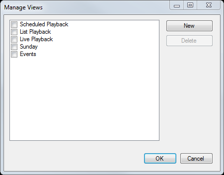

# Window

Screen Monkey allows you to show, hide, pin and dock almost any part of the user interface in any location. It is possible to make unlimited different views to suit any use case. The Window menu accessed from the toolbar allows you to recall, save and manage views.

To make it easy to switch between different layouts or restore a previous layout you can save your window positions to a view. It is then simple to restore those layouts with one button press. You restore a Window layout by selecting the desired view from the Window menu. All the windows move to the position at the point when you saved the view.

## Menu items
There are a number of sub menus which are described below.

## Live Playback

## List Playback

## Scheduled Playback

## Customize
To save a view, arrange the windows in the positions you want, then click Window and choose Customize. The Manage Views dialog appears which allows you to add or remove your own saved views. To save the current view click ‘New’ and enter the name you want to give to the view. Your new view will now appear in the toolbar Window menu.

To remove views place a tick to the left of the view name you wish to remove and then press ‘Delete’.

## Lock Layout
Select this item to prevent windows from being moved or closed. To disable the lock select it again.

## Reset
Reset back to the default view as first installed. This is useful if the windows become jumbled or if you accidentally closed a window and can’t find it again.
