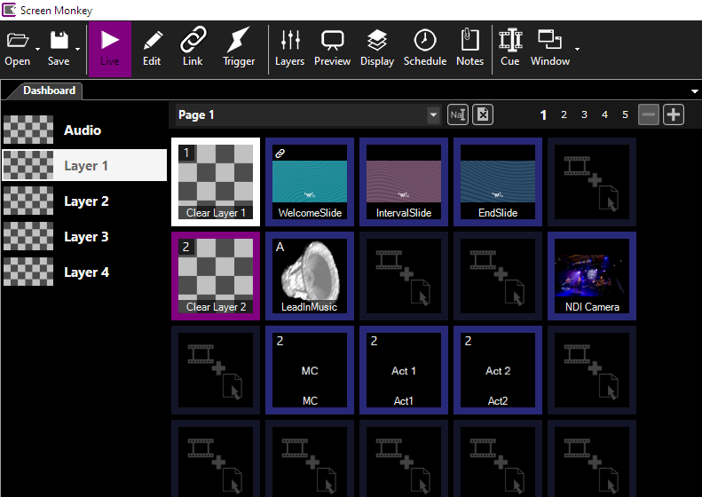

# Using Screen Monkey for a Concert

In this example we will assume we are using Screen Monkey in a concert scenario. The concert will contain the following elements:

1.  Lead in music
2.  Image with concert logo  
3.  Master of ceremonies live video
4.  Supplemental images 
5.  Lower thirds for each performer  
6.  Lead out music

As you can see we need to be able to easily present different types of media. For our example concert we have two different audio files in MP3 format, a live video feed, several different images that will be presented, and lower third text superimposed over the video.

## Preparing Screen Monkey before the concert
Before the concert begins you will want to prepare Screen Monkey and our media. 

First we [add the media files](../reference/CreatingClips.md) to Screen Monkey. The easiest way to add a media file to Screen Monkey is to drag the file from Windows Explorer to an empty slot. We do this for the MP3 files and images. 

The lower third is created from the [text clip](../reference/clipTypes/Text/TextClip.md) by adding two text caption objects will filled backgrounds. This allows you to quickly create multiple lower thirds from the same text clip template. The background of the text clip is set to 'none' so that only the strap appears on top of the video.

To take a live video feed into Screen Monkey we are going to use the [NDI clip](../reference/clipTypes/ndi.md) which can receive video from a suitable NDI camera on the local network.

To make the show as simple as possible to operate we will put the lower third clips on Layer 2 so that they appears on top of the video automatically. To do this [layers are pre-assigned](../reference/clipSettings/layer.md) to the clips. 

We will link the lead in music to the concert image with a [pair link](../reference/clipSettings/link.md) so that they play together. Add a [fade transition](../reference/clipSettings/transition.md) to the music clips and the concert slide.

To save switching layers create a new ['Clear Layer'](../reference/clipTypes/ClearLayerClip.md) clip and assign it to Layer 2 also. Add a fade transition to this clip.

After configuring Screen Monkey with the clips it will look a little like this.

## Presenting the media during the concert

Let's walk through the process of presenting the show at our concert. As the concert begins we need to play our Lead In music as well as present the concert logo image. We click the LeadIn audio clip once and the Lead In music will begin playing and the concert image will also appear on the projection system because the clips are linked.

You can see the clips are active because the clip outline changes colour. A play arrow will appear inside the audio clip. The layer previews on the left of the dashboard confirm which clip is on each layer at all times.

When the Master of Ceremonies (MC) approaches the stage it's time to stop the LeadIn music and start the live video feed. Click on the 'Clear Layer 1' to remove the concert logo from the output. The music will also stop because it is paired. 

Click the NDI video camera icon to start showing the live video. At this point the MC is on stage and about to begin talking to the audience and introduce the first group. When there is a close up shot of the MC you will want to display the lower third that will display their name.

To display the lower third, click the text clip to present it. Because you assigned it to Layer 2 it is presented in front of the Live video feed so your audience sees both at the same time. To remove the lower click on 'Clear Layer 2'.

From here forward, you would just click the clips as you need them. For example, when the first group comes on stage, you would click their image to announce them. As each performer receives a close up, you click their name to present the lower third. 

At the end of the concert there maybe more images to display and an additional music clip. These are presented in the same way.

As you can hopefully see, it's really easy to present the content. Using Screen Monkey there was no need for locating the audio files, opening and playing them using a media player. No need to use something like a video switcher to change from presenting live video to images or images to live video.

This topic presented one possible use of Screen Monkey. The intent was to provide an overview of how such a situation might unfold. As you may imagine, simplicity was the goal here. There are more efficient ways of working with Screen Monkey. For example, pre-assigning clips so that they appear on specific layers.