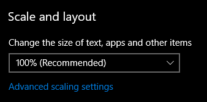
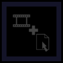
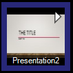

# Getting Started
This is a very brief overview of Screen Monkey. To learn all the many features and possibilities of Screen Monkey read the [reference documents](../reference/mainWindow.md).

## Installation
A standard Windows installer will guide you through the process. Some advanced components are optional.

## Codecs
To play media files smoothly you will probably need to download and install [KLite Full](https://codecguide.com/download_kl.htm). Screen Monkey works best with ffdshow.

## Outputs
In most use cases you will need a secondary display connected to the computer running Screen Monkey which will be used to display the media, text or presentations. The secondary display could be a large TV screen, a projector, a vision mixer or a video encoder. As long as Windows can see it Screen Monkey can use it. Configure Screen Monkey to use the secondary display in [Display Profiles](../reference/toolbar/display.md). 

## Display scaling
If using Windows 10 the display scaling must be set to 100% for Screen Monkey to work correctly. This can be set in Windows Display Settings.

## Overview
All uses of Screen Monkey are essentially a two step process.

1. You create a show and add media as clips. Creating a show is similar to PowerPoint, where you create a blank presentation, then add elements that will be presented.

2. You play the clips you have added either manually or automatically. This is similar to PowerPoint, where you launch the slide show and present it to the audience.

Unlike PowerPoint, Screen Monkey does not restrict you to fully building the show before presenting. It’s very easy to present and edit the show simultaneously. In this regard using Screen Monkey is somewhat similar to a programmable lighting console.

## Loading a Clip
Drag a media, image or PowerPoint file from Windows Explorer and drop it onto one of the empty panels. Alternatively left click on any empty panel and choose a clip type.

Optionally you can change the name, add effects, add transitions, cue in/out points, add scheddule and edit links by right clicking on the clip thumbnail in the panel.

## Running the Show
1. Left click the desired clip using the mouse and its border will turn purple to indicate it is live.  
      
  
    
2. To play another clip, left click to select that clip.
    
3. To clear the active clip, left click 'Clear Layer' in the top left of the dashboard.  
      

    
4. To advance a PowerPoint slide left click on the clip panel using the mouse or use the left and right arrow keys.

## Next Steps
There are as many ways to use Screen Monkey as you can dream up. So that you can get started, three possible uses are outlined in this section.

- [Church Service](UsingForAChurchService.md)
- [Concert](UsingForAConcert.md)
- [Conference](UsingForAConference.md)
- [TV Station](UsingForTV.md)

## Further Reading
All functions of Screen Monkey are documented in this online help document. Continue to a description of the [main window](../reference/mainWindow.md).

## Social Networks
To discuss and share Screen Monkey shows with other users and the developers join the [Screen Monkey Facebook Group](https://www.facebook.com/Screen-Monkey-138931966146473).