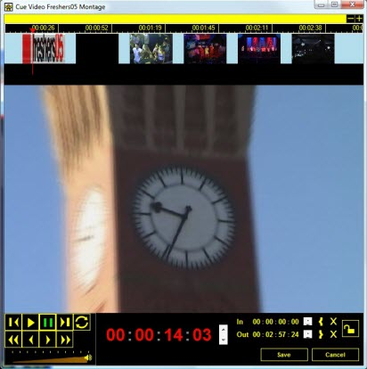
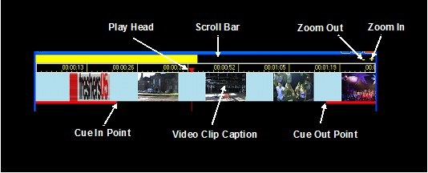
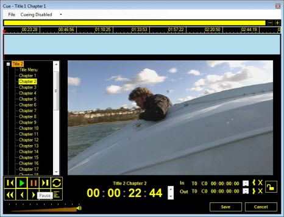
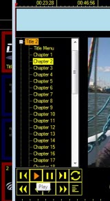
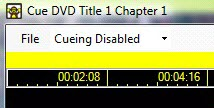
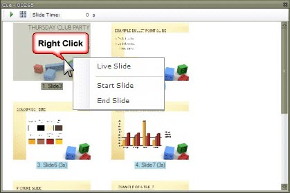
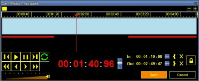
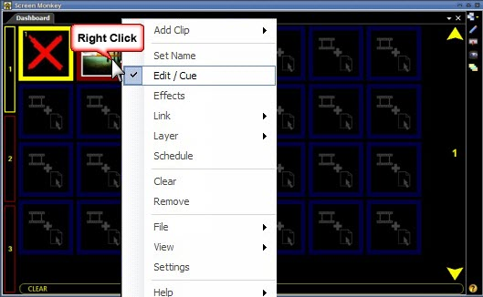

# Editing Clips

## What is cueing?

Cueing is the process of configuring a video, audio or DVD clip to play a smaller segment.

Many different types of media clips support cueing and the cue window changes depending on the clip type you are working with.

When working with video or audio clips you may wish to play a smaller and specific segment of the media or perhaps you wish to begin playing the media at a specific spot. This can be achieved with clip cueing. Cue points allow you to specify a start time and stop time for Video, Audio and DVD clips so you can choose exactly which bit of the media to present.

There are two different ways you can open the Edit / Cue window for a clip.

1.  Right-clicking on an Audio, DVD or Video clip and selecting Edit / Cue.
    
2.  Clicking the 'Cue' toolbar icon and selecting the desired clip to cue. When you click the toolbar icon the clips will begin flashing blue to indicate that Screen Monkey is waiting for a clip to be selected.

## Cue Video Clip
Once you have selected the clip to cue, the Cue dialog should be presented.

The main part of the clip window displays the video, which will allow you to choose which section of the video you wish to play.

### Playback Controls

|Icon|Tool|Description|
|-|-|-|
||Jump To Start|Jumps to the start of the video clip or if the In Time is locked then jumps to the In Time.|
||Play|If the video clip is stopped or paused then will play the video clip.|
||Pause|Pauses the video clip by holding it at its current position|
||Jump To End|Jumps to the end of the video clip or if the Out Time is locked then jumps to the Out Time.|
||Fast Reverse|Rewinds the video clip by 10 seconds.|
||Frame Reverse|Rewinds the video clip by a single frame and Pauses playback.|
||Frame Advance|Moves the clip forwards by a single frame and Pauses playback.|
||Fast Forwards|Moves the clip forwards by 10 seconds.|
||Loop|When selected the video will start playing from the start when it reaches the end of the clip. This button will be highlighted green to indicate it is selected.|

### Timecode  
      
  

Displays the position of the video clip in Hours : Minutes : Seconds : MilliSeconds.  
      
You can change the current clip position by selecting either hours, minutes, seconds and milliseconds and incrementing it using the up and down arrows or typing in a new time. The clip will then move to the configured time.
    
### Cue Controls  
      
  
      
This is where you set the start and end time of the video for playback in the main control panel.  
      
To set the In time either set the time using the time control in the same way as you would the main time or go to the point in the media at which you want to start and then click the Cue In button.  
      
To set the Out time either set the time using the time control in the same way as you would the main time or go to the point in the video at which you want to end and then click the Cue Out button.
    
|Icon|Tool|Description|
|-|-|-|
||Cue In|Sets the clip start time to the current position of the video clip.|
||Cue Out|Sets the clip end time to the current position of the video clip.|
||Lock In and Out Times|When locked the clip will play using the specified start and stop times. If unlocked then the clip will ignore the specified stop and start times by simply playing from the start of the video.|

When Cueing enabled is selected  the clip will use the cue times during playback in the main control panel. This is automatically enabled when you set the cue times. If you do not want the clip to use the cue times and just want it to play normally, de-select cueing enabled. This option is also shown when you right click on a clip in the control panel by a tick next to "Cue".

### Timeline  
      
  
      
The timeline allows you to quickly search through a video clip and select the cue in and out points. The scroll bar and zoom controls allow you to view the right point in your video clip. If you need to see a point in the video that is not in display then you can drag the scroll bar to the right point. The zoom controls allow you to zoom in and see the video in more detail.  
      
To play a point in the timeline you can drag the play head to the correct point and select play. The video will now start playing from this point in the timeline.  
      
You set the cue in and out point from directly in the timeline by putting your mouse over the cue in and out points and dragging it to the required point in the timeline.
    
### Volume Control  
      
  
      
Use the volume control to adjust the volume which the clip is played at. Any volume set here will be used when playing the clip live.
    

## Cue DVD Clip

Cueing a DVD is similar to cueing a video but the DVD cue window has a few differences.

The main difference is the support for title and chapter select.

### Chapter Control  
      
  
      
If you want to jump to a specific chapter or title during cueing, you may select them from the tree list. The DVD will then jump to the selected chapter.  
      
The current title and chapter are now displayed above the timecode.  
      
  
      
When a DVD has been cued it will ignore the selected DVD chapter from the popup menu unless you disable cueing.
    
### Export Cue Settings  
      
You can save the current cue settings of the DVD to an xml file which can be taken and used on a sepperate computer.  
      
  
      
To export the cue times, click File > Export Times. You will then be asked where you want to save the xml file that will contain the cue times.  
      
To import the cue settings on another computer, create a DVD clip with the same DVD. Open the cue DVD dialog for the new DVD clip and click File > Import Times. Locate the previously saved xml file and click OK. The new clip will now be configured using the saved cue times.

## Cue PowerPoint

If you middle click with the mouse button on a PowerPoint clip it will bring up the cue dialog, a nice shortcut instead of going through the menu.

In this dialog you can set several options which saves the need to go back to PowerPoint to edit the file.

*   You can set a slide that is selected to go Live.
    
*   You can set a Start Slide if you need a different one to the prearranged one, and also for the Slide Time.
    
*   You can set the End slide for the Slide Time.
    
*   You can set a Slide Time in seconds to automatically advance the desired slides.  
      
    

The slides which are selected to be displayed are highlighted in blue and the live slide is highlighted in yellow. You can change the selected slides to be displayed by selecting the range of slides and clicking the set slide range button in the top bar.

You can change the live slide by selecting the slide and clicking the play button. If the clip is active then the screen will be updated immediately. You can also set a slide to be live by double clicking on it.

The transition time for slides is set by selecting them and then typing in a new time in the toolbar.

## Cue Audio

The audio clip has a cue control which allows you to specify a start and stop time for the audio clip. The play controls and timeline allow you to navigate the audio to find the in and out points you want. You then select the set In/Out point buttons to play just the clip you want. The loop button can be pressed to create an audio loop.

The thumbnail in an audio clip is now automatically generated from the album art in the ID3 tag. If your MP3 contains album art in the ID3 tag then you will see that image instead of the default audio clip logo.

